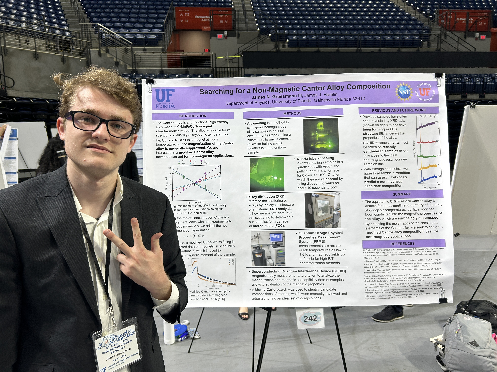
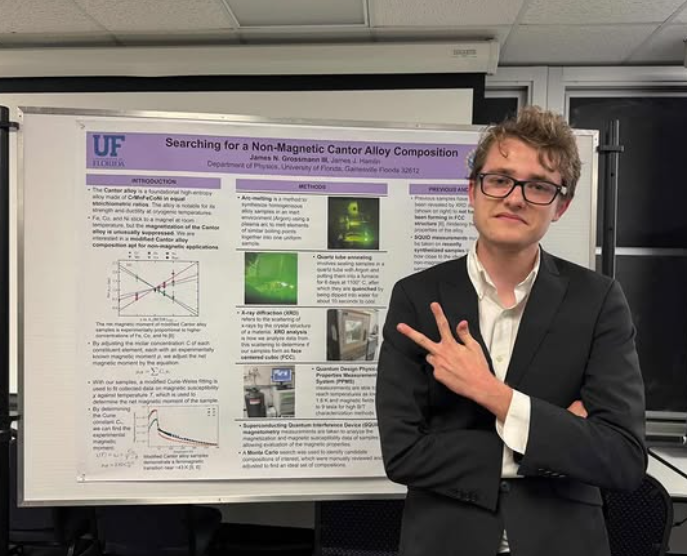
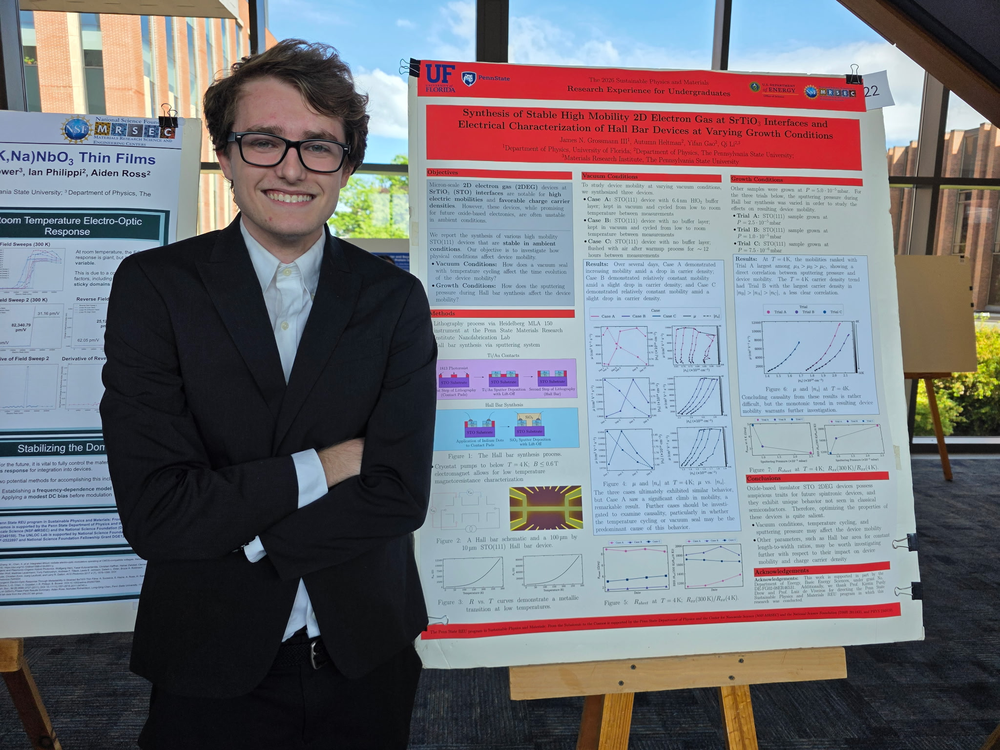



Hamlin Group -- University of Florida Research Group
======
I have worked under Prof. James Hamlin in his experimental condensed matter physics [research group](https://legacy.phys.ufl.edu/~jhamlin/index.html) since the summer of 2025. I have thus far participated in two projects. 

One of my projects in the Hamlin group relates to the magnetic properties of the equiatomic CrMnFeCoNi Cantor alloy. In particular, I am interested in identifying a modified Cantor alloy composition that minimizes the magnetic susceptibility of the alloy, generating a material apt for non-magnetic applications given the favorable strength and ductility of the Cantor alloy at cryogenic temperatures. A Monte Carlo algorithm is used to predict candidate compositions of interest, and samples are synthesized through arc-melting, undergo a quartz tube sealing, annealing, and quenching process, and characterized through MPMS and SQUID magnetometry. I was awarded the University of Florida University Scholars Program award for the 2026-2027 academic year based on the proposal of this project.

* **J.N. Grossmann III**, J.J. Hamlin, "Searching for a Non-Magnetic Cantor Alloy Composition," University of Florida Center for Undergraduate Research 2026 Spring Symposium.
* **J.N. Grossmann III**, J.J. Hamlin, "Searching for a Non-Magnetic Cantor Alloy Composition," University of Florida Department of Physics Research Poster Presentation Session 2026.

My other project in the Hamlin group relates to the experimental problem of synthesizability, which concerns how various materials fail to form in phases predicted by high-throughput computational databases such as [OQMD](https://oqmd.org/). Through this project, I have developed significant experience in arc-melting for bulk material synthesis. Additionally, I have developed experience with X-ray diffraction (XRD) in order to characterize the phases of the ~50 samples I synthesized. We found that the vast majority of materials did not form in expected phases, a remarkable result we are currently preparing a journal publication to share.

* G. Di Gianluca, J. Niedel, J. Esquivel, **J.N. Grossmann III**, T. Miniati, M. Crossman, Z. Li, P. Prakash, B. Geisler, J. Kim, R. Hennig, P. Hirschfeld, G. Stewart, J.J. Hamlin, "From Database to Diffractometer: Putting Structure Predictions to the Test," American Physical Society (APS) Global Physics Summit 2026. https://meetings-archive.aps.org/smt/2026/mar-g26/2/
* G. Di Gianluca, J. Niedel, J. Esquivel, **J.N. Grossmann III**, T. Miniati, M. Crossman, Z. Li, P. Prakash, B. Geisler, J. Kim, R. Hennig, P. Hirschfeld, G. Stewart, J.J. Hamlin, "Synthesizability of Computationally Predicted Novel Materials," University of Florida Center for Undergraduate Research 2026 Spring Symposium.
* G. Di Gianluca, J. Niedel, J. Esquivel, **J.N. Grossmann III**, T. Miniati, M. Crossman, Z. Li, P. Prakash, B. Geisler, J. Kim, R. Hennig, P. Hirschfeld, G. Stewart, J.J. Hamlin, "Synthesizability of Computationally Predicted Novel Materials," University of Florida Department of Physics Research Poster Presentation Session 2026.

  
  

Li Group -- The Pennsylvania State University REU Program
======

I participated in the 2026 Sustainable Physics and Materials REU program at The Pennsylvania State University, where I characterized the electrical properties of micron-scale 2D electron gas (2DEG) devices formed at SrTiO3 (STO) interfaces during my time working in Prof. Qi Li's [research group](https://sites.psu.edu/qililabgroup/).

I synthesized various STO(111) 2DEG devices that were stable under ambient conditions via a photolithography (Heidelberg MLA 150 instrument) and sputtering process in the Penn State Materials Research Institute Nanofabrication Lab (Cleanroom). I investigated the effects of air exposure and sputtering pressure on the resulting device mobility. I was able to identify physical parameters and conditions that allowed numerous devices to maintain optimal mobility and charge carrier density conditions over time. I intend to present the results of this work at the 2027 Americal Physical Society (APS) Global Physics Summit.

* **J.N. Grossmann III**, A. Heltman, Y. Gao, Q. Li, "Synthesis of Stable High Mobility 2D Electron Gas at SrTiO3 Interfaces and Electrical Characterization of Hall Bar Devices at Varying Growth Conditions," 2026 17th Annual Penn State REU Symposium. https://doi.org/10.5281/zenodo.21519449

  

Collider Physics at the Higgs Frontier -- University of Florida Research Course
======

During the Spring 2026 semester, I took a collider physics [research course](https://ufl.instructure.com/courses/554803/assignments/syllabus) taught by Prof. Philip Chang, which contained lectures on conceptual elements of modern CMS and LHC experiments and directed research projects with CMS 2018 Run D data sets. 

Through this work, I developed experience in Python, C++, and ROOT programming through the University of Florida HiPerGator supercomputing cluster. I also gained knowledge in machine learning and signal training; for the capstone project of the course, I was tasked with using a Binary Decision Tree (BDT) classifier algorithm to isolate the extraordinarily rare di-Higgs signal from typical Standard Model background in a CMS dataset. For this project, my best result attained a 95% confidence level population mean value of 11.535, denoting an effective analysis.
